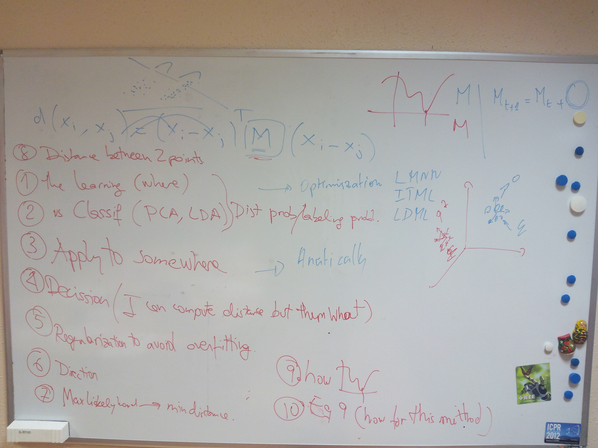
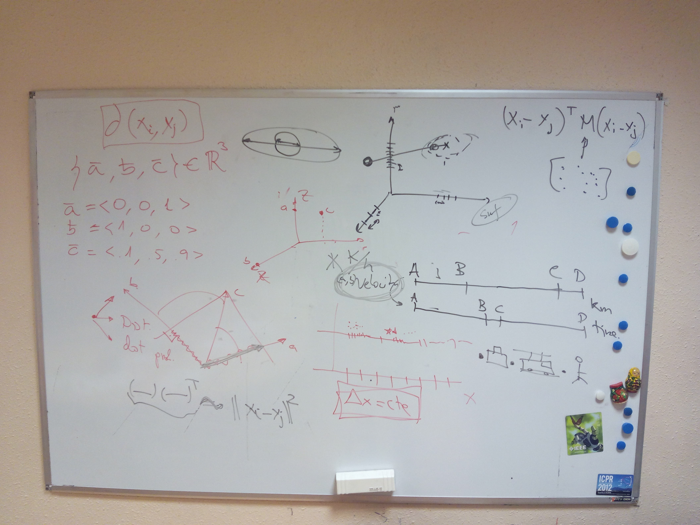
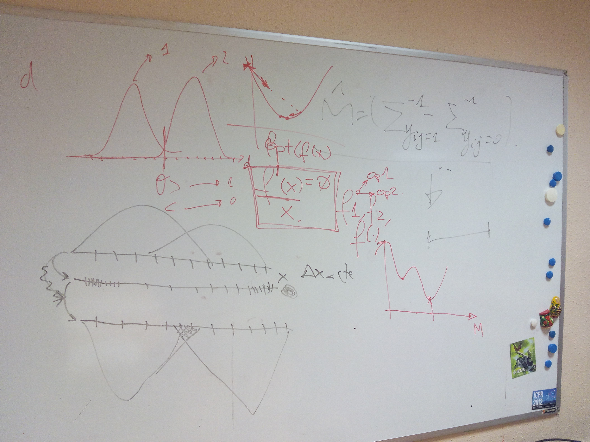
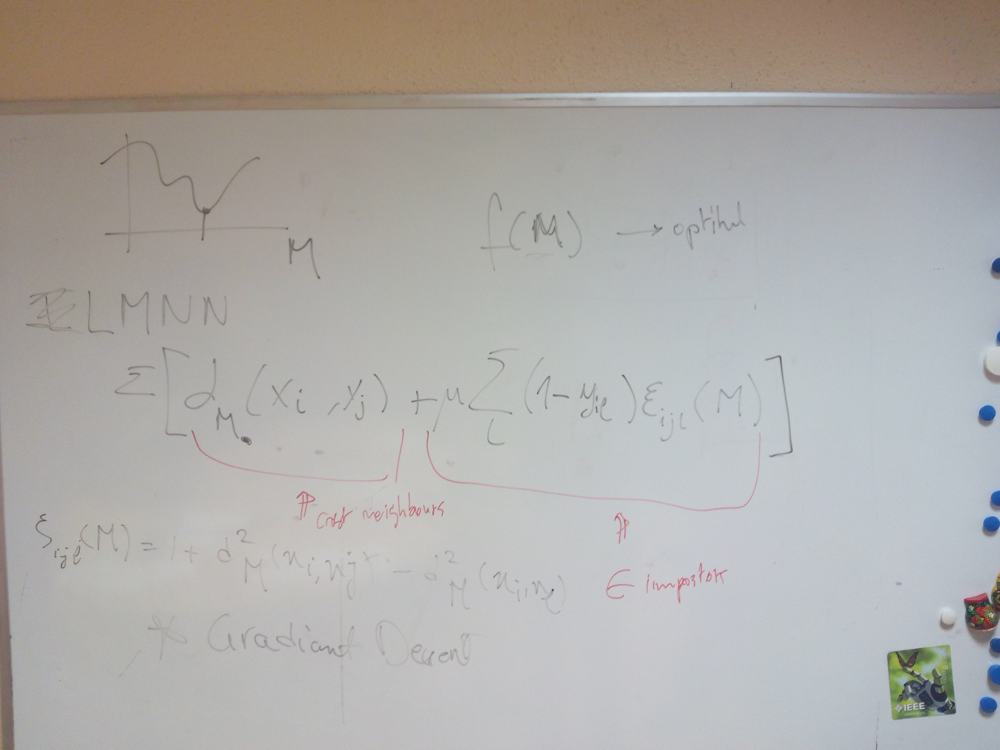
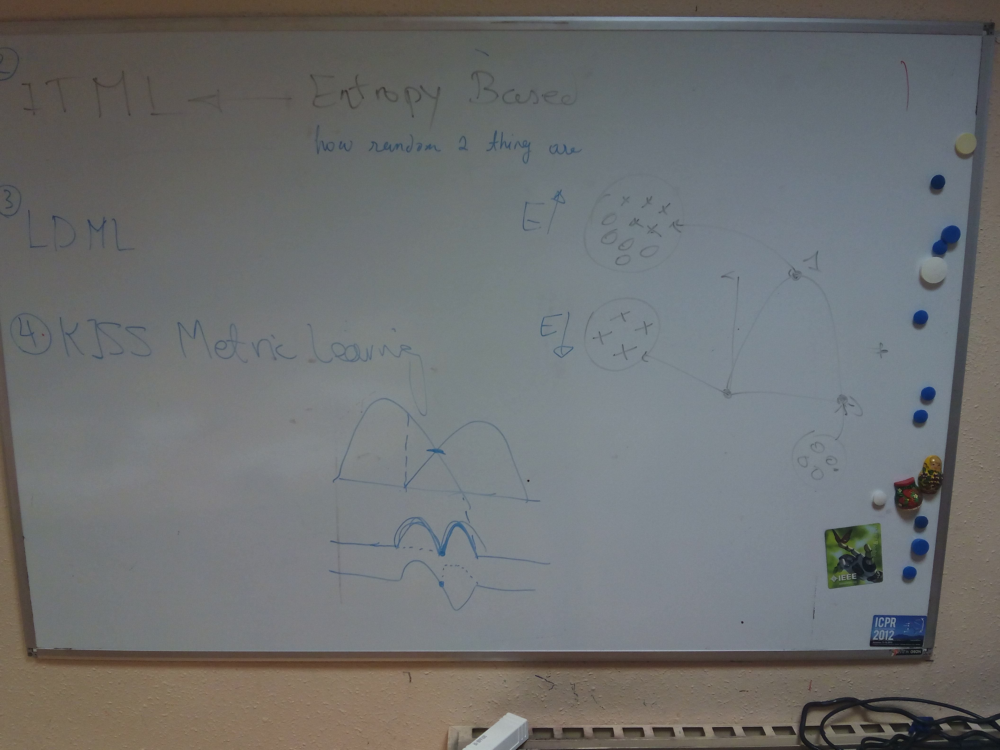
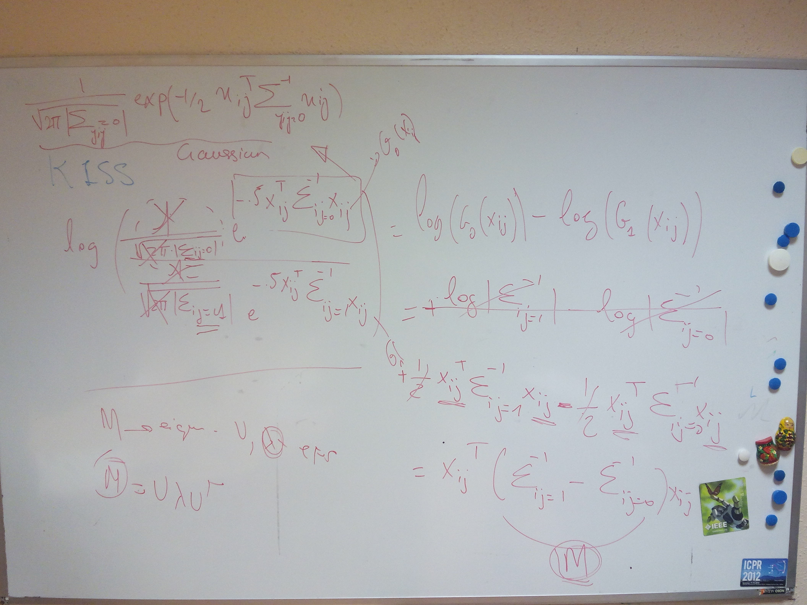
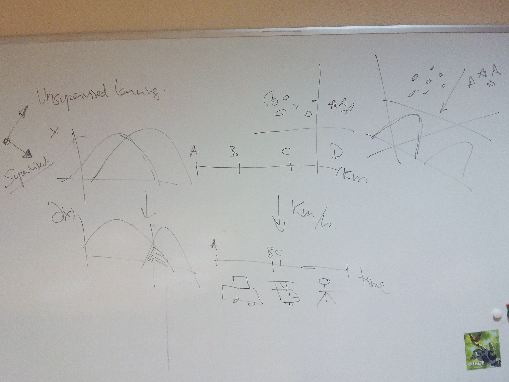

# Header

---------------------------

Find the following information about this article:

    Title: Large scale metric learning from equivalence constraints
    Author: Kostinger, Hirzer, Wohlhart, Roth, Bischof
    Journal/Conference: CVPR
    Year: 2012

# Graphical Abstract

---------------------------

# Highlight
* Different distance measure ? 
* Mahalanobis distance?  
* The topic indicates learning which correspond to what ?
* What are the main difference and similiarity between prpopsed method and PCA and LDA?
* What can be achieved from the distance?
* Regularization to avoid overfitting 
* Maxliklihood --> Minimum distance
* How to minimize (Do we need optimization method ? Or we can solve it without them in much easier way using this method?) 

---------------------------

# Discussions

---------------------------

## Preminilary

Definition of metric learning

* Definition of Mahalanobis distance
* Specific case of Euclidean distance
* What Mahalahanobis and the covariance matrice will imply

## State-of-the-art

### LMNN

Check the following [notebook](http://www.shogun-toolbox.org/static/notebook/current/LMNN.html) for an entire description of LMNN. 

### ITML

Entropy driven optimisation.

## KISS ML

